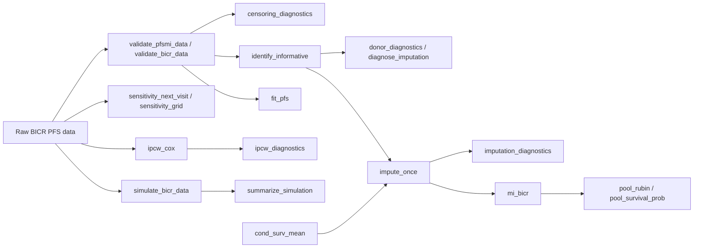

# pfsmi: PFS Multiple Imputation

`pfsmi` implements a multiple imputation sensitivity analysis for progression-free survival (PFS) assessed by blinded independent central review (BICR) when local investigator and BICR discrepancies may cause informative censoring.

The package is intended for sensitivity analysis. It does not replace the prespecified primary BICR analysis. The main workflow is to validate the data, diagnose local-central discrepancy censoring, perform ordinary BICR and local analyses, run the BICR-specific MI analysis, and report deterministic and IPCW comparator analyses with diagnostics.

## Installation

Install the package from a local source tarball:

```r
install.packages("pfsmi_0.2.0.tar.gz", repos = NULL, type = "source")
```

During development, install from the source directory:

```r
install.packages("pfsmi", repos = NULL, type = "source")
```

Before a CRAN submission, replace the maintainer email and project URLs in `DESCRIPTION` with project-specific information and run `R CMD check --as-cran` in a local R environment.

## Package architecture



## Minimal example

```r
library(pfsmi)

set.seed(1)
dat <- simulate_bicr_data(n_per_arm = 100, seed = 1)

# Validate input and inspect censoring patterns
validate_pfsmi_data(dat)
validate_bicr_data(dat)
censoring_diagnostics(dat, visit_interval = 6)

# Primary BICR analysis
fit_pfs(dat)$cox

# Identify potentially informative censoring and inspect imputation support
inf <- identify_informative(dat, visit_interval = 6)
table(Informative = inf, Arm = dat$trt)
dx <- diagnose_imputation(dat, visit_interval = 6)
dx$type_counts
dx$donor_summary

# Multiple imputation analysis
mi <- mi_bicr(
  dat,
  m = 20,
  visit_interval = 6,
  seed = 2026,
  times = c(12, 24),
  conditional_method = "draw",
  bootstrap_donors = TRUE
)
mi$cox
mi$median
mi$surv_prob
imputation_diagnostics(mi)

# Deterministic sensitivity analyses
sens <- sensitivity_next_visit(dat, visit_interval = 6)
fit_pfs(sens, time = "pfs_sensitivity", event = "event_sensitivity")$cox
sensitivity_grid(dat, visit_interval = 6, delays = c(0, 6, 12))

# IPCW comparator with weight diagnostics
wfit <- ipcw_cox(dat, censor_covariates = "trt")
summary(wfit$fit)
ipcw_diagnostics(wfit)
```

## Exported functions

### `validate_pfsmi_data()` and `validate_bicr_data()`

Check that the analysis data set has required columns, finite nonnegative time variables, and binary event indicators.

```r
validate_pfsmi_data(dat)
validate_bicr_data(dat)
```

### `simulate_bicr_data()`

Simulates two-arm BICR data with local investigator times, BICR times, local-BICR disagreements, and continued-scan indicators.

```r
dat <- simulate_bicr_data(
  n_per_arm = 300,
  med_inv = c(trt = 28, ctl = 19),
  med_bicr = c(trt = 30, ctl = 23),
  disagreement = c(trt = 0.6, ctl = 0.3),
  stay = c(trt = 0.3, ctl = 0.3),
  seed = 42
)
```

### `censoring_diagnostics()`

Summarizes BICR events, BICR censoring, local events, flagged subjects, and continued scans by treatment arm.

```r
censoring_diagnostics(dat, visit_interval = 6)
```

### `identify_informative()`

Flags subjects with local PD and BICR censoring close to the local PD time.

```r
inf <- identify_informative(dat, visit_interval = 6)
mean(inf)
```

### `donor_diagnostics()` and `diagnose_imputation()`

Report imputation support, including counts by imputation type and donor-set size summaries.

```r
dx <- donor_diagnostics(dat, visit_interval = 6)
dx$type_counts
dx$donor_summary
diagnose_imputation(dat, visit_interval = 6)
```

### `cond_surv_mean()`

Computes a conditional restricted mean survival imputation from a Kaplan-Meier curve. This is primarily a deterministic diagnostic alternative to stochastic conditional draws.

```r
cond_surv_mean(dat$obs_pfs_bicr, dat$event_bicr, lower = 12, upper = 24)
```

### `impute_once()`

Creates one imputed data set using donor-risk-set imputation and conditional-survival imputation. The default `conditional_method = "draw"` uses stochastic conditional draws; `bootstrap_donors = TRUE` resamples donor risk sets within arm.

```r
imp <- impute_once(dat, visit_interval = 6, conditional_method = "draw", bootstrap_donors = TRUE)
table(imp$impute_type)
imputation_diagnostics(imp)
```

### `fit_pfs()`

Fits the ordinary Cox model, log-rank test, and Kaplan-Meier median PFS summary.

```r
fit_pfs(dat)$cox
fit_pfs(imp, time = "pfs_imputed", event = "event_imputed")$cox
```

### `pool_rubin()` and `pool_survival_prob()`

Combine scalar estimates and standard errors across imputed data sets. Survival probabilities are pooled on a complementary log-log scale.

```r
pool_rubin(c(0.1, 0.2, 0.15), c(0.05, 0.06, 0.05))
pool_survival_prob(c(0.62, 0.64, 0.61), c(0.05, 0.05, 0.06))
```

### `mi_bicr()`

Runs repeated imputation, analyzes each imputed data set, and pools treatment-effect estimates.

```r
mi <- mi_bicr(dat, m = 20, visit_interval = 6, seed = 99,
              times = c(12, 24), bootstrap_donors = TRUE)
mi$cox
mi$surv_prob
mi$diagnostics$donor_summary
```

### `sensitivity_next_visit()` and `sensitivity_grid()`

Set flagged subjects to deterministic event times for stress-test sensitivity analyses.

```r
sens <- sensitivity_next_visit(dat, visit_interval = 6)
fit_pfs(sens, time = "pfs_sensitivity", event = "event_sensitivity")$cox
sensitivity_grid(dat, visit_interval = 6, delays = c(0, 6, 12))
```

### `ipcw_cox()` and `ipcw_diagnostics()`

Fit a simple stabilized IPCW Cox comparator and summarize weight stability. This comparator should be interpreted only after checking the weight distribution and whether the censoring model is scientifically plausible.

```r
ipcw <- ipcw_cox(dat, censor_covariates = "trt")
summary(ipcw$fit)
ipcw_diagnostics(ipcw)
```

### `summarize_simulation()`

Computes simple summaries of repeated simulation outputs.

```r
summarize_simulation(list(c(hr = 0.7, p = 0.01), c(hr = 0.8, p = 0.04)))
```
